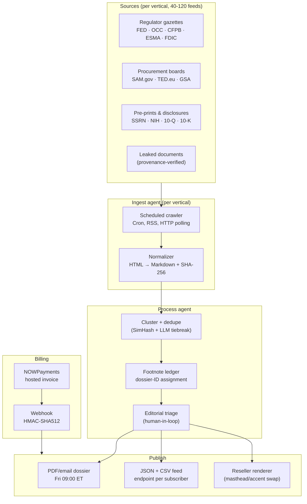

# 02 — Architecture

## System diagram

## Components

| Component | Purpose | Tech |
|---|---|---|
| Landing | Marketing surface, NOWPayments CTA | Next.js 15 + Tailwind v4 |
| Checkout API | `POST /api/checkout/nowpayments` server-side invoice creation | Next.js route handler |
| Webhook handler | `POST /api/webhooks/nowpayments` IPN verification (HMAC-SHA512) | Next.js route handler + `node:crypto` |
| Ingest agent (planned) | Pulls 40-120 feeds per vertical, hashes raw text | Node + Bun cron + Postgres |
| Process agent (planned) | SimHash dedupe, LLM-assisted clustering, dossier-ID assignment | Bun service + LLM via OpenRouter |
| Reseller renderer (planned) | Re-mastheads each dossier per reseller config | React PDF / Pandoc |
| SaaS app (planned) | Subscriber dashboard, feed endpoints, reseller config | Wasp / Open-SaaS |

## Data flows

1. **Subscribe.** Visitor selects plan → `POST /api/checkout/nowpayments` → server signs request to NOWPayments `POST /v1/invoice` → returns `invoice_url` → visitor redirects to NOWPayments hosted page → pays USDT/USDC → NOWPayments fires IPN to `/api/webhooks/nowpayments` → server verifies `x-nowpayments-sig` HMAC-SHA512 → upserts subscriber record → triggers welcome email + first-issue replay (Wave 3 scope).
2. **Issue cycle.** Sun 17:00 ET: ingest agent freezes the input set for the week. Mon-Wed: process agent runs dedupe + footnote-ID assignment. Thu: human editorial triage at the desk. Fri 09:00 ET: publish runs (PDF + email + feed + reseller renders).
3. **Reseller config.** Reseller gives wordmark, accent hex, optional logo SVG, footer line, and target URL. The renderer emits the same dossier under their masthead and pings their delivery endpoint at the same Fri 09:00 ET window plus a configurable lag (so they can stage their own send).

## Deploy topology (Wave 2)

| Surface | Where | What runs |
|---|---|---|
| `info-aggregator-reseller.prin7r.com` | `storage-contabo` (`161.97.99.120`) under Traefik | Next.js 15 standalone container (port 3000) |
| TLS | Let&rsquo;s Encrypt resolver `letsencrypt` (HTTP-01 challenge) | Auto-issued by Traefik on first request |
| DNS | Wildcard `*.prin7r.com → 161.97.99.120` | Existing Cloudflare A record |
| Build | `Dockerfile.landing` (multistage Node 22 alpine, standalone Next output) | `docker compose build` then `up -d` |
| Env | `/opt/prin7r-deploys/info-aggregator-reseller/.env` (gitignored) | Loaded into the container via `env_file: .env` in compose |

Wave 3 will add:
- `api.info-aggregator-reseller.prin7r.com` — a Bun + Hono service for ingest + process agents.
- `app.info-aggregator-reseller.prin7r.com` — Open-SaaS forked dashboard (subscriber + reseller surfaces).
- A managed Postgres at `db.prin7r.com` (or per-project DB on `storage-contabo`).
- A render worker that pulls from a pub/sub queue per issue.
