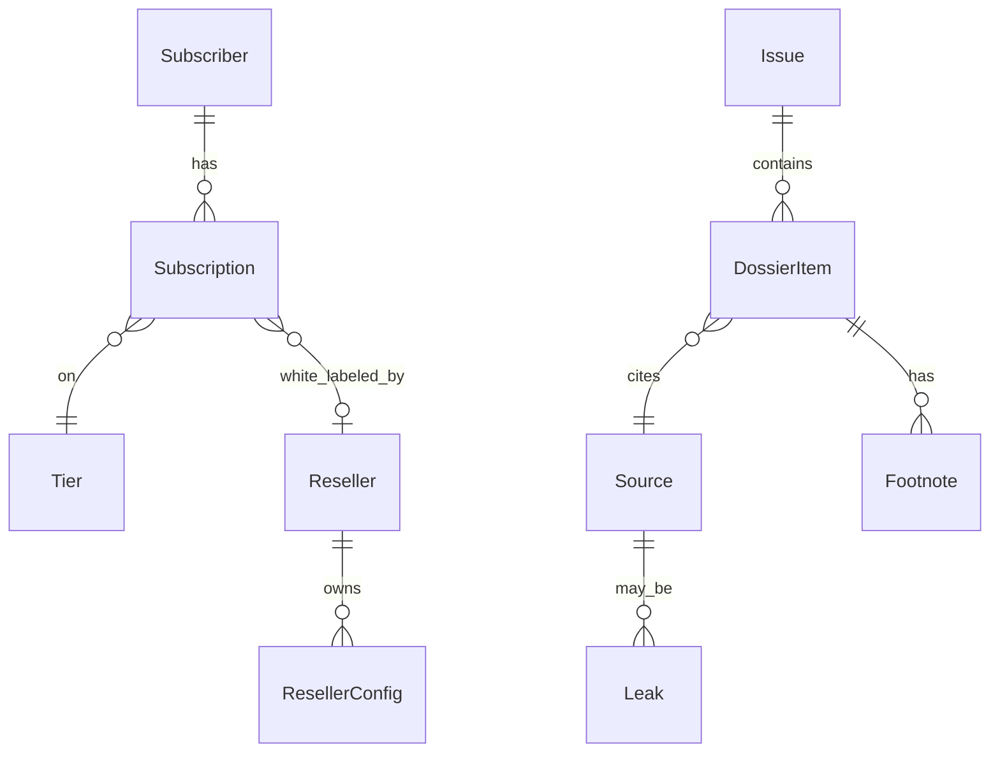

# 12 — Technical Specification

This is the authoritative technical contract for Bureau Wave 2 → Wave 3. Doc 11 specifies user-visible flows; this doc specifies runtime, schema, contracts, and operational guardrails. Every endpoint here traces back to a story in doc 11.

Bureau is a content-aggregation product with editorial-integrity guarantees: ingest → dedupe → footnote → triage → publish. Multi-tenant rendering at publish time produces per-reseller customizations.

---

## 1. Architecture overview

```mermaid
flowchart TB
  subgraph Sources[Sources per vertical, 40-120 feeds]
    REG[Regulator gazettes]
    PROC[Procurement boards]
    PAPER[Pre-prints + disclosures]
    LEAK[Leaked documents]
  end

  subgraph IngestSvc[Wave 3: workers/ingest]
    CRAWL[Scheduled crawler<br/>Cron + RSS + HTTP polling]
    NORM[Normalizer<br/>HTML to Markdown + SHA-256]
  end

  subgraph ProcessSvc[Wave 3: workers/process]
    DEDUP[Cluster + dedupe<br/>SimHash + LLM tiebreak]
    FOOT[Footnote ledger<br/>dossier-ID assignment]
    TRIAGE[Editorial triage<br/>human-in-loop]
  end

  subgraph PubSvc[Wave 3: workers/publish]
    PDFR[PDF render]
    EM[Email send]
    FEED[Feed update]
    RESEL[Reseller renderer<br/>per-tenant masthead/accent]
  end

  subgraph LandingSvc[Container: info-aggregator-reseller-landing]
    NX[Next.js 15 standalone]
    API_CH[POST /api/checkout/nowpayments]
    API_WH[POST /api/webhooks/nowpayments]
    API_SR[POST /api/sample/request]
  end

  subgraph AppSvc[Wave 3: apps/app]
    APP[Wasp open-saas]
    ADMIN[/admin/triage]
    DBP[(Postgres)]
    Q[BullMQ]
  end

  Sources --> CRAWL --> NORM --> DEDUP --> FOOT --> TRIAGE
  TRIAGE --> PDFR & EM & FEED & RESEL
  NX --> API_CH --> NP[NOWPayments]
  NP --IPN--> API_WH --> APP
  APP --> DBP
  APP --> Q
```

---

## 2. Data model

### 2.1 Entities



### 2.2 Schema sketch (Drizzle, Postgres)

```typescript
export const subscribers = pgTable('subscribers', {
  id: uuid('id').primaryKey().defaultRandom(),
  email: text('email').notNull().unique(),
  firmName: text('firm_name'),
});

export const subscriptions = pgTable('subscriptions', {
  id: text('id').primaryKey(),  // 'bureau_single_<ts>_<rand>'
  subscriberId: uuid('subscriber_id').references(() => subscribers.id),
  tier: text('tier').notNull(),   // 'single'|'bundle'|'reseller'
  vertical: text('vertical'),     // for 'single'
  resellerConfigId: uuid('reseller_config_id'),
  status: text('status').default('pending'),  // 'pending'|'active'|'cancelled'|'paused'
  invoiceId: text('invoice_id'),
  validUntil: timestamp('valid_until'),
  feedToken: text('feed_token').unique(),
  trackedLogUntil: timestamp('tracked_log_until'),  // 3 weeks from start
  createdAt: timestamp('created_at').defaultNow(),
});

export const issues = pgTable('issues', {
  id: text('id').primaryKey(),  // 'B-2026-W19-fintech'
  vertical: text('vertical').notNull(),
  weekStart: date('week_start').notNull(),
  publishedAt: timestamp('published_at'),
  inputCount: integer('input_count'),
  outputCount: integer('output_count'),
  dedupeRatio: numeric('dedupe_ratio', {precision:6,scale:2}),
});

export const sources = pgTable('sources', {
  id: text('id').primaryKey(),  // 'src-fintech-fed-2026-04-12'
  url: text('url').notNull(),
  retrievedAt: timestamp('retrieved_at'),
  sha256: text('sha256').notNull(),
  contentType: text('content_type'),
  isLeak: boolean('is_leak').default(false),
  leakProvenance: jsonb('leak_provenance'),
});

export const dossierItems = pgTable('dossier_items', {
  id: text('id').primaryKey(),  // 'B-2026-W19-§14'
  issueId: text('issue_id').references(() => issues.id),
  sourceId: text('source_id').references(() => sources.id),
  paragraphMarkdown: text('paragraph_markdown').notNull(),
  footnoteRefs: jsonb('footnote_refs').default('[]'),
});

export const resellerConfigs = pgTable('reseller_configs', {
  id: uuid('id').primaryKey().defaultRandom(),
  resellerName: text('reseller_name').notNull(),
  masthead: text('masthead').notNull(),
  accentHex: text('accent_hex'),
  footerLine: text('footer_line'),
  deliveryUrl: text('delivery_url'),
  deliveryLagMin: integer('delivery_lag_min').default(0),
  customDomain: text('custom_domain'),
  logoSvg: text('logo_svg'),
});
```

Indexes: `subscriptions(subscriber_id, status)`, `dossierItems(issue_id)`, `subscriptions(feed_token)` unique.

---

## 3. API contracts

### 3.1 `POST /api/sample/request` (Wave 2 + 3)

- Auth: none.
- Body: `{ name, email, vertical }`.
- Server: validate, store, email editorial desk via Postmark.
- 200: `{ ok: true, eta: 'within 4 business hours' }`.

### 3.2 `POST /api/checkout/nowpayments` (Wave 2 + 3)

- Auth: none.
- Body: `{ tier: 'single'|'bundle', vertical?, firm? }`.
- Returns 201: `{ invoice_url, invoice_id, subscriptionId }`.

### 3.3 `POST /api/webhooks/nowpayments`

- HMAC-SHA512 IPN. Idempotent. On `finished`, activate sub, mint feedToken, send welcome email.

### 3.4 `POST /api/admin/reseller-licenses` (Wave 3)

- Auth: Bearer admin.
- Body: `{ resellerName, verticals, masthead, accentHex, footerLine, deliveryUrl, deliveryLagMin, customDomain, logoSvg }`.
- 201: `{ licenseId, invoiceUrl, configId }`.

### 3.5 `GET /v1/feed/:feedToken` (Wave 3)

- Auth: signed feed token in URL.
- Query: `?format=json|csv&since=YYYY-MM-DD`.
- Returns the subscriber's vertical(s) issues since `since`.
- Rate limit: 60 req/min/token.

### 3.6 `GET /dossier/:itemId` (Wave 3)

- Auth: subscriber session.
- Returns audit drawer: source URL, retrieved_at, sha256, dedupe rationale.

### 3.7 `POST /api/leaks/comment` (Wave 3)

- Auth: per-leak token emailed to the subject.
- Body: `{ leakId, comment, attribution }`.
- Returns 200; records comment for next issue.

### 3.8 `POST /api/admin/leaks` (Wave 3)

- Auth: Bearer admin.
- Body: `{ url, sha256, provenance, subjects }`.
- Records a leak; emits email tokens to subjects.

### 3.9 `POST /api/admin/issues/:id/publish` (Wave 3)

- Auth: Bearer admin (editorial desk).
- Triggers publish job.
- 200: `{ ok, scheduledAt }`.

### 3.10 `POST /api/admin/issues/:id/retract` (Wave 3)

- Auth: Bearer admin.
- Body: `{ reason, retractionNote }`.
- Issues retraction in next week's issue.

---

## 4. Integrations

| Service | Purpose | Auth | Rate limit | Fallback |
|---|---|---|---|---|
| **NOWPayments** | Hosted invoice + IPN | `x-api-key` + HMAC-SHA512 | 60 req/min | Plisio + Reown wired Wave 4 |
| **Postmark** | Editorial desk email + dossier delivery | Server token | 5k/h Pro | BullMQ retry |
| **OpenRouter / Anthropic / OpenAI** | LLM tiebreak in dedupe + summarization | API key | per-provider | Skip LLM tiebreak; SimHash-only fallback |
| **WaybackMachine** | Source-unavailable snapshots | none (public) | n/a | Mark `source_unavailable: true` if no snapshot |
| **Source feeds** | Per-vertical 40-120 RSS / HTTP polling | none / per-source | varies | Per-source retry; quarantine on 3+ failures |

---

## 5. Storage

- **Wave 2.** No DB. Stateless landing.
- **Wave 3.** Postgres on storage-contabo (`db.prin7r.com` if managed). Source content in S3-compatible MinIO.
- **Encryption.** API keys encrypted with `INTEGRATION_KEY`.
- **Retention.**
  - Issues + dossier items: indefinite.
  - Source raw content: 24 months.
  - Subscriber data: GDPR-compliant.
  - Webhook receipts: 30 days stdout, 90 days DB.

---

## 6. Auth

- Public landing: no auth.
- Subscriber dashboard: magic-link via open-saas.
- Admin (editorial desk): Bearer + 2FA at the Wasp layer.
- Per-leak comment: signed one-time token in URL.

---

## 7. Security

Top 5 threats + mitigations:

1. **Forged IPN.** *Mitigation:* HMAC-SHA512 + constant-time compare.
2. **Feed scraping.** *Mitigation:* Per-subscriber HMAC-signed URL with 30-day rotation; 60 req/min rate limit; anomaly alerting.
3. **Libel from leaked documents.** *Mitigation:* Provenance verification before publish; 24+ hour subject notice; comment-from-subject mechanism; retraction protocol.
4. **Editorial-integrity attack (compromised LLM tiebreak).** *Mitigation:* Tiebreaks reviewed by editorial desk on Thursday triage; SimHash baseline always available.
5. **Reseller masthead misuse (claiming Bureau editorial).** *Mitigation:* License terms forbid; co-branded methodology page documents the relationship; Bureau retains editorial control.

CSRF: Next.js + samesite. CORS: locked to Bureau domain + custom-domain resellers (per-reseller allowlist).

---

## 8. Observability

- **Logs.** Stdout JSON `{ ts, level, route, event, message }`. PII scrubbed.
- **Metrics.** Wave 3: ingestion lag per source, dedupe-ratio per issue, feed RPS per subscriber, retraction count.
- **Alerts.**
  - Webhook sig failures >2/h → Slack `#alerts-bureau`.
  - Source quarantined → editorial desk email.
  - Dedupe ratio anomaly (>50% drop or rise) → Slack.
  - Reseller delivery endpoint failures → Slack + email reseller.

---

## 9. Performance budgets

| Surface | Metric | Budget |
|---|---|---|
| Landing TTFB | p95 | <200ms |
| Landing LCP | p75 | <2.5s |
| `POST /api/checkout/nowpayments` | p95 | <1.5s |
| `POST /api/webhooks/nowpayments` | p95 | <250ms |
| `GET /v1/feed/:token` | p95 | <500ms |
| `GET /dossier/:id` | p95 | <300ms |
| Issue publish job | wall | <10min for 5 verticals + 8 resellers |

---

## 10. Non-goals

- **No "free month" trial** (doc 11 AS-1).
- **No AI-hype copy** (AS-2).
- **No tweet-quoting in dossiers** (AS-3).
- **No leak paraphrasing** (AS-4).
- **No SOC 2 / regulated-use certification** (AS-5).
- **No public scraping endpoints** (AS-6).
- **No social-feature / community** between subscribers.
- **No mobile-native apps.** Responsive web only.
